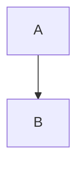

# 🧰 Toolbox Architecture  
*A defensive, operator‑grade design for Linux incident response*

Toolbox is built around a clean, predictable architecture that emphasises **defensive workflows**, **safe execution**, and **operator clarity**.  
This document provides a high‑level overview of how the toolbox is structured, how tools are discovered, and how operators interact with the suite.

---

# 📐 Architecture Diagram

The following diagram shows the core components of the Toolbox ecosystem and how they relate to each other.

This version is **fully GitHub‑compatible** and will render correctly.
.markdown

---

# 🏗️ Core Components

## **1. Operator**
The human operator is the centre of the toolbox workflow.  
They interact with:

- the `tool-box` indexer  
- individual tools  
- documentation  
- system state  

The toolbox is designed to be predictable, safe, and transparent for the operator at all times.

---

## **2. tool-box (Indexer)**  
The `tool-box` script acts as the **central indexer** for the entire suite.

It:

- scans the three tool directories  
- extracts metadata (Version, Purpose)  
- displays a unified, formatted tool list  
- provides help for Bash tools  
- ensures consistent discoverability  

This gives the operator a single, reliable entry point into the toolbox.

---

## **3. Tool Directories**

Toolbox tools are organised by language:

| Language | Path |
|----------|------|
| **Bash**   | `/usr/local/bin/bash` |
| **Python** | `/usr/local/bin/python` |
| **PHP**    | `/usr/local/bin/php` |

This separation ensures:

- predictable behaviour  
- clean indexing  
- language‑specific execution models  
- easier maintenance  
- consistent documentation  

Each directory contains tools that follow the same metadata and versioning conventions.

---

## **4. Bash Tools**

Bash tools form the backbone of the defensive suite.  
They include:

- system diagnostics  
- cleanup and hygiene  
- hashing and verification  
- PostgreSQL helpers  
- session repair  
- safe remote transfer  
- memory‑dump analysis wrappers  

These tools are designed to be:

- fast  
- predictable  
- auditable  
- safe for IR environments  

---

## **5. Python Tools**

Python tools provide more advanced logic and structured analysis, including:

- domain connectivity checks  
- injection scanning engine  
- VyOS zone‑pair generation  
- educational brute‑force demonstration  

These tools follow the same metadata and versioning model as Bash tools.

---

## **6. PHP Tools**

The PHP directory exists for completeness and future expansion.  
At present, it contains no active tools.

---

## **7. Documentation**

All documentation lives under `/docs` and includes:

- tool‑specific guides  
- workflows  
- architecture  
- ethics and philosophy  
- changelogs  

Documentation is treated as a first‑class component of the toolbox.

---

## **8. Defensive Principles**

The entire toolbox is built around a clear defensive philosophy:

- **Safe execution models**  
- **No offensive tooling**  
- **Predictable behaviour**  
- **Operator clarity**  
- **Transparent metadata**  
- **Ethical boundaries**  

These principles shape every tool and every design decision.

---

# 🔄 Operator Workflow

A typical operator workflow looks like this:

1. **Run `tool-box`**  
   Discover available tools and confirm versions.

2. **Execute a tool**  
   e.g., `diag`, `cleanup`, `pgsql-state`, `xfer`, etc.

3. **Review documentation**  
   When needed, consult `/docs` for deeper context.

4. **Perform defensive or IR tasks**  
   Using safe, bounded, predictable tools.

5. **Maintain system hygiene**  
   Using `update`, `cleanup`, and diagnostics.

This workflow is intentionally simple, predictable, and repeatable.

---

# 🧩 Why This Architecture Works

This design gives you:

- **Clarity** — tools are easy to find, understand, and use  
- **Safety** — no offensive or uncontrolled execution paths  
- **Consistency** — metadata, versioning, and structure are unified  
- **Extensibility** — new tools can be added without breaking the model  
- **Professionalism** — suitable for IR teams and production environments  

It reflects a mature, defensive engineering philosophy.

---
