# 🧼 clean-lp — Workflow Diagram  
*A visual guide to cleaning linPEAS output for analysis, parsing, or storage*

`clean-lp` removes ANSI escape codes and invalid UTF‑8 bytes from linPEAS output, producing a clean, plain‑text file suitable for upload, parsing, or long‑term storage.  
This workflow asset shows the exact decision path and behaviour of the tool.

---

## 📊 Workflow Diagram (Mermaid)

```mermaid
flowchart TD

    A["Start:\nUser runs 'clean-lp <input> <output> [flags]'"] --> B["Validate input and output arguments"]

    B -->|Missing| Z1["Error:\nMissing input or output file\nExit"]
    B -->|Present| C["Check if input file exists"]

    C -->|Missing| Z2["Error:\nInput file not found\nExit"]
    C -->|Exists| D["Were flags provided?"]

    D -->|--dry-run| E["Dry-run mode:\nReport intended action\nExit"]
    D -->|--verbose| F["Verbose mode:\nEnable logging"]
    D -->|None| G["Proceed with cleaning"]

    %% Cleaning Path
    F --> G
    G --> H["Strip ANSI escape codes"]
    H --> I["Remove invalid UTF-8 bytes"]
    I --> J["Write cleaned output to file"]
    J --> END["Done:\nCleaned file created ✓"]
```



---

# 🧩 Workflow Summary

This section breaks down the diagram into clear, operator‑friendly steps.

---

## **1. Argument Validation**

The tool checks:

- Was an input file provided?  
- Was an output file provided?  

If either is missing, the tool exits with a usage message.

---

## **2. Input File Check**

If the input file does not exist, the tool exits immediately:

```
[ERROR] Input file does not exist: <file>
```

This prevents accidental overwrites or wasted processing.

---

## **3. Flag Handling**

### **--dry-run**
- Shows what would happen  
- Does not modify any files  
- Useful for cautious operators  

### **--verbose**
- Enables logging  
- Shows internal steps  
- Useful for debugging or transparency  

---

## **4. Cleaning Process**

If not in dry‑run mode, the tool performs two operations:

### **1. Strip ANSI escape codes**
Removes:

- colour codes  
- cursor movement  
- formatting sequences  

These make raw linPEAS logs unreadable in plain text.

### **2. Remove invalid UTF‑8**
Sanitises:

- malformed characters  
- broken byte sequences  
- terminal artefacts  

This ensures compatibility with:

- web uploaders  
- AI tools  
- parsers  
- log processors  

---

## **5. Output**

The cleaned file is written to the specified output path:

```
[OK] Cleaned linPEAS output written to: <output-file>
```

---

# 🧭 When This Workflow Is Useful

### ✔ Preparing linPEAS output for upload  
Some analyzers reject ANSI‑encoded logs.

### ✔ Feeding linPEAS output into automated tools  
Colour codes break most parsers.

### ✔ Storing logs as evidence  
Clean logs are more stable and readable.

### ✔ Working in DFIR environments  
ANSI output can contaminate evidence chains.

---

# 🧭 When This Workflow Is *Not* Required

Your current workflow:

- run linPEAS  
- copy/paste sections into a website or AI tool  
- get structured analysis  

In this case:

### ❌ You do not need `clean-lp`  
because you are not uploading or parsing the raw `.log` file.

---

# 🔗 Related Documentation

| Document | Purpose |
|---------|---------|
| `docs/clean-lp.md` | Full documentation for the clean-lp tool |
| `docs/hash.md` | Hash creation and verification |
| `docs/xfer.md` | Remote transfer + integrity workflows |
| `docs/diag.md` | Diagnostics and environment checks |

---

## 🤖 AI & Ethics Disclosure

This workflow asset was co‑authored with AI assistance.  
For details on responsible use, transparency, and authorship, see the **AI & Ethics** section in the Toolbox README.

🔙 Return to Toolbox (GitHub)
