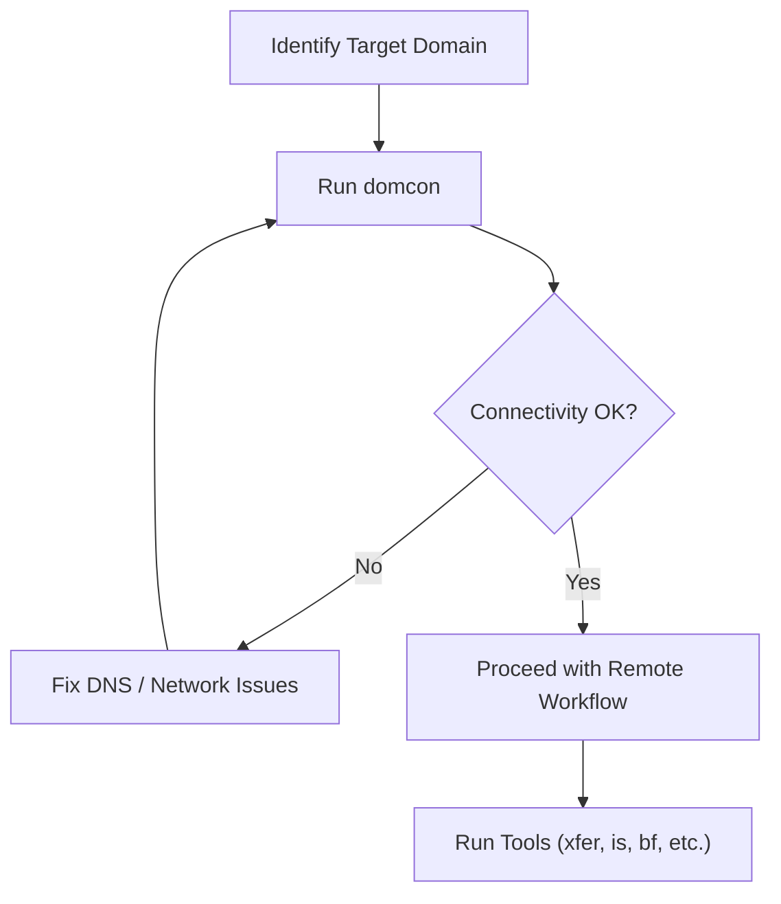

# 📘 **domcon Workflow — Connectivity Preflight for Remote Targets**

## 1. Introduction

`domcon` is designed to be the **first tool you run** when preparing to interact with a remote target.  
Before scanning, brute forcing, transferring files, or performing any remote workflow, you need to confirm:

- the domain resolves  
- the host is reachable  
- essential ports are open  
- the web service responds  

This workflow document shows where `domcon` fits into the bigger picture and how it supports your other tools such as:

- `xfer`  
- `is` (Injection Scanner Engine)  
- `bf` (Brute Force Demonstrator)  
- `mda4w` (Memory Dump Analysis)  
- `diag`  

It ensures you don’t waste time troubleshooting tools when the real issue is simply **connectivity**.

---

## 2. High‑Level Workflow



This diagram shows the intended role of `domcon`:  
**validate connectivity before doing anything else**.

---

## 3. Step‑by‑Step Workflow

### **Step 1 — Identify the target domain**

This may come from:

- a THM room  
- a lab environment  
- a remote host  
- a challenge description  
- an internal system  

Example:

```
ntlmauth.za.tryhackme.com
```

---

### **Step 2 — Run domcon**

```
domcon ntlmauth.za.tryhackme.com
```

This performs:

- DNS resolution  
- ping  
- port checks (80, 443, 8080)  
- HTTP HEAD request  

---

### **Step 3 — Interpret the results**

#### If DNS fails:
- the domain is wrong  
- the DNS server is unreachable  
- the target is offline  

#### If ping fails:
- ICMP may be blocked  
- but the host may still be alive  

#### If ports are closed:
- the service may be down  
- firewall rules may block access  

#### If curl fails:
- the web service may be offline  
- or using HTTPS only  
- or behind a reverse proxy  

---

### **Step 4 — Fix connectivity issues (if any)**

This may involve:

- correcting the domain  
- checking VPN connection  
- verifying DNS settings  
- waiting for the THM instance to start  
- restarting the target machine  

Once fixed, run `domcon` again.

---

### **Step 5 — Proceed with remote workflows**

Once connectivity is confirmed, you can safely run:

#### ✔ **xfer**  
Pull/push files, execute commands remotely.

#### ✔ **is**  
Run injection scanning safely.

#### ✔ **bf**  
Demonstrate password pattern brute forcing.

#### ✔ **diag**  
Perform system diagnostics.

#### ✔ **mda4w**  
If acquiring memory dumps remotely.

`domcon` ensures these tools won’t fail due to basic connectivity issues.

---

## 4. Example Workflow (THM Scenario)

### Target:
```
webapp.thm.local
```

### Step 1 — Preflight check:
```
domcon webapp.thm.local
```

### Step 2 — If all checks pass:
```
xfer pull /var/www/html/index.php
is --url http://webapp.thm.local
bf --url http://webapp.thm.local/login --user admin --pic 99A9
```

### Step 3 — Begin analysis or exploitation  
You now know the host is reachable and responding.

---

## 5. Why This Workflow Matters

Running `domcon` first prevents:

- false assumptions  
- wasted time  
- misdiagnosed tool failures  
- confusion during THM rooms  
- unnecessary debugging  

It gives you a **clean, reliable baseline** before you run anything more complex.

This is exactly how professional operators work:  
**validate connectivity → then proceed**.

---

## 6. Summary

`domcon` fits into the remote‑target workflow as the **first step**:

1. Identify target  
2. Run domcon  
3. Confirm connectivity  
4. Fix issues if needed  
5. Proceed with remote tools  

It’s a small tool that prevents big headaches.

---

## 📢 Disclaimer

This tool performs **non‑destructive connectivity checks only**.  
It does **not** perform scanning, enumeration, or offensive actions.  
Use responsibly and only in environments where you have explicit permission.

---

## 🤖 AI & Ethics Disclosure

This tool and its documentation were co‑authored with AI assistance.  
For details on responsible use, transparency, and authorship, see the **AI & Ethics** section in the Toolbox README.

🔙 Return to [Toolbox](https://github.com/Mark-a-Hamilton/Toolbox)

