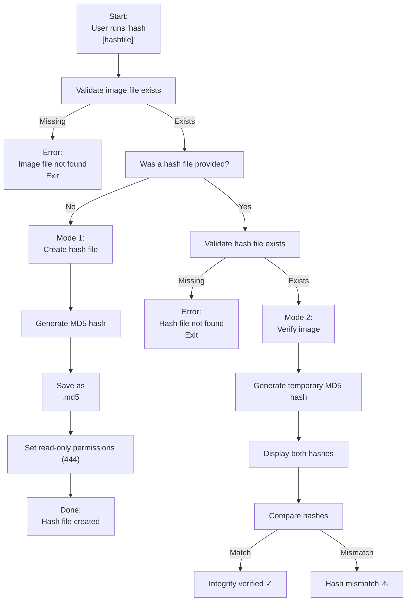

# 🔐 hash — Workflow Diagram  
*A visual guide to generating and verifying MD5 hash files*

The `hash` tool provides two clear operational modes:

- **Mode 1:** Create a hash file for an image  
- **Mode 2:** Verify an image against an existing hash file  

This workflow asset shows the exact decision path, expected behaviour, and operator‑grade logic behind the tool.

---

## 📊 Workflow Diagram (Mermaid)



---

# 🧩 Workflow Summary

This section breaks down the diagram into clear, operator‑friendly steps.

---

## **1. Input Validation**

The tool first checks:

- Was an image filename provided?  
- Does the image file exist?  

If the image is missing, the tool exits immediately with a clear error.

If a hash file is provided, the tool also checks:

- Does the hash file exist?  

If not, it exits cleanly with an error.

This prevents accidental misuse.

---

## **2. Mode Selection**

The tool determines its mode based on the number of arguments:

### **One argument → Mode 1 (Create hash)**  
### **Two arguments → Mode 2 (Verify hash)**

This ensures predictable, unambiguous behaviour.

---

# 🛠️ Mode 1 — Create a Hash File

Triggered when the user runs:

```
hash <image>
```

### Steps:

1. Validate the image exists  
2. Generate an MD5 hash  
3. Save it to `<image>.md5`  
4. Set the file to read‑only (`chmod 444`)  
5. Exit cleanly  

### Purpose:

- Create baseline integrity data  
- Prepare evidence for transfer  
- Support chain‑of‑custody workflows  
- Document acquisition integrity  

---

# 🛠️ Mode 2 — Verify Against an Existing Hash File

Triggered when the user runs:

```
hash <image> <hashfile>
```

### Steps:

1. Validate both files exist  
2. Generate a temporary MD5 hash  
3. Display both hashes  
4. Compare them  
5. Report match or mismatch  
6. Clean up temporary file  

### Purpose:

- Verify integrity after transfer  
- Detect tampering  
- Validate forensic images  
- Confirm backup integrity  

---

# 🧭 Expected Outcomes

### **Integrity Verified**
```
✓ Hashes match — image integrity verified.
```

### **Integrity Failure**
```
⚠️ Hash mismatch — image may be altered or corrupted.
```

### **Missing Files**
```
Error: Image file not found.
Error: Hash file not found.
```

---

# 🔗 Related Documentation

| Document | Purpose |
|---------|---------|
| `docs/hash.md` | Full documentation for the hash tool |
| `docs/xfer.md` | Remote transfer + integrity workflows |
| `docs/cleanup.md` | System hygiene and temp file cleanup |
| `docs/diag.md` | Diagnostics and environment checks |

---

## 🤖 AI & Ethics Disclosure

This workflow asset was co‑authored with AI assistance.  
For details on responsible use, transparency, and authorship, see the **AI & Ethics** section in the Toolbox README.

🔙 Return to Toolbox (GitHub)

