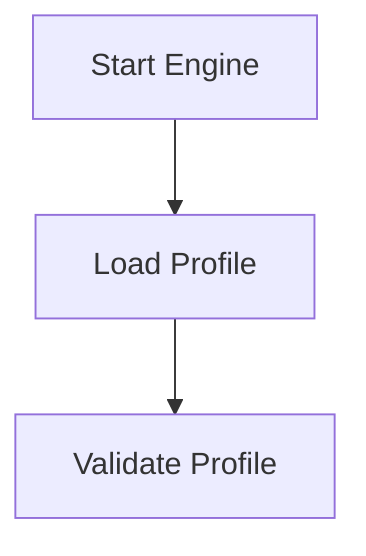

# 📐 Injection Scanner (is) — Engine Workflow Diagram


    C -->|Valid| D["Payload Loop"]
    C -->|Invalid| Z["Exit Error"]

    D --> E["Send Request"]
    E --> F["Receive Response"]

    F --> G["Check Modules"]
    G --> H["Check Signatures"]

    H --> I["Match Found"]
    H --> J["No Match"]

    I --> K["Record Finding"]
    J --> L["Next Item"]

    K --> L
    L -->|More| D
    L -->|Done| M["Generate Report"]

    M --> N["Check DBI"]
    N -->|None| Q["Finish"]
    N -->|Found| R["Classify DB"]

    R --> S["Check Auto Creds"]
    S -->|No| Q
    S -->|Yes| T["Run Cred Extraction"]

    T --> Q

---

# 🧩 What This Diagram Shows

### ✔ **Profile Loading**
The engine loads:

- `profiles/stealth.json` by default  
- or any profile specified with `--profile`  

### ✔ **Payload Loop**
Each payload is sent **once**, regardless of how many modules use it.

### ✔ **Module Loop**
Every module checks the same response for its own signatures.

### ✔ **Signature Matching**
If a signature matches:

- the finding is recorded  
- classification is applied (e.g., SQL vs NoSQL)  

### ✔ **DBI Classification**
If DBI is detected:

- the engine determines SQL or NoSQL  
- this enables optional credential extraction  

### ✔ **Credential Extraction**
Only runs when:

```
--auto-creds
```

is used.

### ✔ **Safe Termination**
The engine never:

- exploits  
- brute‑forces  
- fuzzes  
- modifies state  

It only detects and reports.

---


