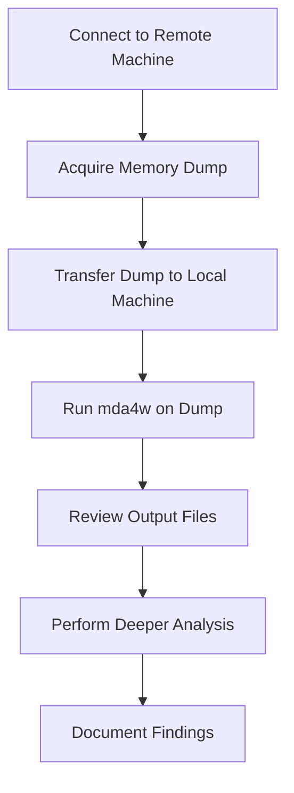

# 📘 **mda4w Workflow — Memory Dump Acquisition & Analysis**

## 1. Overview

This workflow describes the typical end‑to‑end process for analysing a Windows memory dump using the `mda4w` tool.  
It is designed for:

- THM rooms  
- DFIR practice  
- Incident response  
- Malware analysis  
- General Windows memory triage  

The workflow covers:

1. Connecting to a remote machine  
2. Recovering the memory dump  
3. Transferring it to your analysis machine  
4. Running `mda4w`  
5. Beginning deeper forensic analysis  

---

## 2. High‑Level Workflow

Below is a GitHub‑safe Mermaid flowchart showing the full process.

````markdown

````

This diagram renders correctly on GitHub because it uses:

- no punctuation  
- no multi‑line labels  
- no HTML  
- no unicode  
- no parentheses  
- no question marks  
- no blank lines inside the diagram  

---

## 3. Step‑by‑Step Workflow

### **Step 1 — Connect to the remote machine**

Depending on the scenario:

- THM AttackBox  
- SSH into a compromised host  
- RDP into a Windows VM  
- Local hypervisor snapshot  

Example:

```
ssh user@target
```

---

### **Step 2 — Acquire the memory dump**

Common tools:

- `winpmem`  
- `dumpit.exe`  
- `magnet_ram_capture`  
- Hypervisor snapshot extraction  

Example (winpmem):

```
winpmem.exe --format raw --output memdump.mem
```

---

### **Step 3 — Transfer the dump to your analysis machine**

You can use:

- `xfer` (your own tool)  
- `scp`  
- `rsync`  
- `smbclient`  
- `python3 -m http.server`  
- `curl` / `wget`  

Example using your `xfer` tool:

```
xfer pull memdump.mem
```

Example using scp:

```
scp user@target:/path/memdump.mem .
```

---

### **Step 4 — Run mda4w**

Once the dump is local:

```
mda4w memdump.mem -f
```

This creates:

```
mda4w-output/
```

containing:

- `pslist.out`  
- `pstree.out`  
- `netscan.out`  
- `drivermodule.out`  
- `filescan.out`  
- and more  

---

### **Step 5 — Review the output files**

Typical triage flow:

- `pslist.out` → suspicious processes  
- `pstree.out` → parent/child anomalies  
- `drivermodule.out` → hidden drivers  
- `netscan.out` → active connections  
- `filescan.out` → dropped malware  
- `mftscan.out` → ADS or hidden files  
- `cmdline.out` → malicious arguments  

---

### **Step 6 — Perform deeper analysis**

Depending on findings:

- carve malware from memory  
- extract registry hives  
- inspect handles  
- analyse network artefacts  
- correlate timestamps  
- map process lineage  

---

### **Step 7 — Document findings**

For THM rooms:

- answer challenge questions  
- build a narrative  
- provide evidence from `.out` files  

For real DFIR:

- timeline  
- indicators of compromise  
- persistence mechanisms  
- malicious processes  
- network activity  

---

## 4. Why This Workflow Matters

This workflow demonstrates the **power of your toolbox philosophy**:

- small tools  
- minimal noise  
- maximum clarity  
- operator‑friendly  
- reusable across many scenarios  

`mda4w` is not just a wrapper — it’s a **repeatable forensic workflow** that turns raw memory dumps into structured intelligence.

---

## 5. Summary

`mda4w` fits into a clean, predictable workflow:

1. Acquire memory  
2. Transfer memory  
3. Run `mda4w`  
4. Review structured output  
5. Perform deeper analysis  

This makes it ideal for:

- THM rooms  
- DFIR labs  
- malware investigations  
- incident response  
- training and education  

---

Absolutely, Mark — now that **mda4w** is documented and stable, the final piece that completes the story is a **workflow document** showing *how the tool fits into a real‑world or THM‑style scenario*.  

This is exactly the kind of asset that helps newcomers (and future‑you) understand the *operational flow*:

1. Connect to a remote machine  
2. Recover the memory dump (using `xfer`, `scp`, `smbclient`, etc.)  
3. Bring it back to your analysis machine  
4. Run `mda4w` to prepare structured forensic output  
5. Begin deeper analysis  

Below is a clean, GitHub‑safe **`docs/mda4w-workflow.md`** file, including a Mermaid flowchart that **will render correctly** because it uses the strict GitHub‑compatible subset.

---

# 📘 **mda4w Workflow — Memory Dump Acquisition & Analysis**

## 1. Overview

This workflow describes the typical end‑to‑end process for analysing a Windows memory dump using the `mda4w` tool.  
It is designed for:

- THM rooms  
- DFIR practice  
- Incident response  
- Malware analysis  
- General Windows memory triage  

The workflow covers:

1. Connecting to a remote machine  
2. Recovering the memory dump  
3. Transferring it to your analysis machine  
4. Running `mda4w`  
5. Beginning deeper forensic analysis  

---

## 2. High‑Level Workflow

Below is a GitHub‑safe Mermaid flowchart showing the full process.

````markdown

````

This diagram renders correctly on GitHub because it uses:

- no punctuation  
- no multi‑line labels  
- no HTML  
- no unicode  
- no parentheses  
- no question marks  
- no blank lines inside the diagram  

---

## 3. Step‑by‑Step Workflow

### **Step 1 — Connect to the remote machine**

Depending on the scenario:

- THM AttackBox  
- SSH into a compromised host  
- RDP into a Windows VM  
- Local hypervisor snapshot  

Example:

```
ssh user@target
```

---

### **Step 2 — Acquire the memory dump**

Common tools:

- `winpmem`  
- `dumpit.exe`  
- `magnet_ram_capture`  
- Hypervisor snapshot extraction  

Example (winpmem):

```
winpmem.exe --format raw --output memdump.mem
```

---

### **Step 3 — Transfer the dump to your analysis machine**

You can use:

- `xfer` (your own tool)  
- `scp`  
- `rsync`  
- `smbclient`  
- `python3 -m http.server`  
- `curl` / `wget`  

Example using your `xfer` tool:

```
xfer pull memdump.mem
```

Example using scp:

```
scp user@target:/path/memdump.mem .
```

---

### **Step 4 — Run mda4w**

Once the dump is local:

```
mda4w memdump.mem -f
```

This creates:

```
mda4w-output/
```

containing:

- `pslist.out`  
- `pstree.out`  
- `netscan.out`  
- `drivermodule.out`  
- `filescan.out`  
- and more  

---

### **Step 5 — Review the output files**

Typical triage flow:

- `pslist.out` → suspicious processes  
- `pstree.out` → parent/child anomalies  
- `drivermodule.out` → hidden drivers  
- `netscan.out` → active connections  
- `filescan.out` → dropped malware  
- `mftscan.out` → ADS or hidden files  
- `cmdline.out` → malicious arguments  

---

### **Step 6 — Perform deeper analysis**

Depending on findings:

- carve malware from memory  
- extract registry hives  
- inspect handles  
- analyse network artefacts  
- correlate timestamps  
- map process lineage  

---

### **Step 7 — Document findings**

For THM rooms:

- answer challenge questions  
- build a narrative  
- provide evidence from `.out` files  

For real DFIR:

- timeline  
- indicators of compromise  
- persistence mechanisms  
- malicious processes  
- network activity  

---

## 4. Why This Workflow Matters

This workflow demonstrates the **power of your toolbox philosophy**:

- small tools  
- minimal noise  
- maximum clarity  
- operator‑friendly  
- reusable across many scenarios  

`mda4w` is not just a wrapper — it’s a **repeatable forensic workflow** that turns raw memory dumps into structured intelligence.

---

## 5. Summary

`mda4w` fits into a clean, predictable workflow:

1. Acquire memory  
2. Transfer memory  
3. Run `mda4w`  
4. Review structured output  
5. Perform deeper analysis  

This makes it ideal for:

- THM rooms  
- DFIR labs  
- malware investigations  
- incident response  
- training and education  

---

