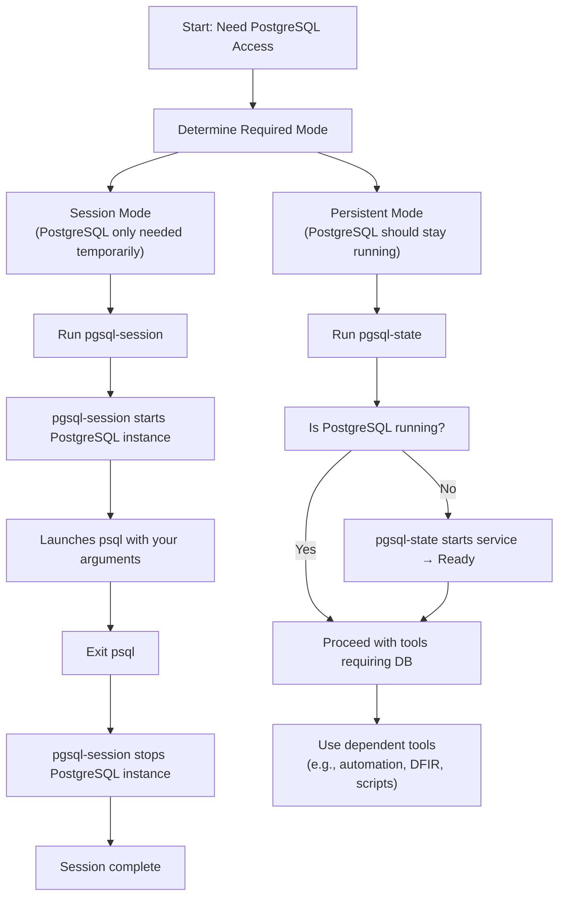

# 🐘 PostgreSQL Tools Workflow  
*A visual guide to using pgsql‑state and pgsql‑session together in minimal, lab, and DFIR environments*

The Toolbox includes two PostgreSQL‑related utilities:

- **`pgsql-state`** — ensures PostgreSQL is running persistently  
- **`pgsql-session`** — starts PostgreSQL only for the duration of a `psql` session  

These tools support different operational models depending on whether PostgreSQL is needed **continuously** or **temporarily**.

This asset provides a visual workflow showing how they fit together and when each should be used.

---

## 📊 Workflow Diagram (Mermaid)

---

# 🧩 Understanding the Two Modes

## **1. Persistent Mode — Use `pgsql-state`**
Choose this when:

- PostgreSQL should remain running  
- multiple tools or scripts will use the database  
- you’re working on a long‑running project  
- you want PostgreSQL available across sessions  
- you’re running automation or scheduled tasks  

`pgsql-state` ensures the service is active and ready.

---

## **2. Session Mode — Use `pgsql-session`**
Choose this when:

- PostgreSQL is only needed temporarily  
- you want to minimise background services  
- you’re working in a DFIR or lab VM  
- you want PostgreSQL to stop automatically  
- you’re running a one‑off query or test  

`pgsql-session` starts PostgreSQL only for the duration of your `psql` session, then shuts it down.

---

# 🛠️ How the Tools Work Together

### **pgsql-state**
- Ensures PostgreSQL is running  
- Starts the service if needed  
- Leaves it running for other tools  

Ideal for:

- automation  
- scripts  
- long‑running workflows  
- environments where PostgreSQL should stay active  

---

### **pgsql-session**
- Starts PostgreSQL only for the current session  
- Runs `psql` in the foreground  
- Stops PostgreSQL automatically when you exit  

Ideal for:

- minimal systems  
- DFIR workflows  
- temporary database access  
- environments where PostgreSQL should not remain active  

---

# 🧭 Example Scenarios

### **Scenario 1 — Running a DFIR triage tool**
Use: **`pgsql-session`**

Why:  
You want PostgreSQL active only while collecting evidence, not running persistently.

---

### **Scenario 2 — Running a web app locally for development**
Use: **`pgsql-state`**

Why:  
The app expects PostgreSQL to be running continuously.

---

### **Scenario 3 — Running a one‑off SQL query**
Use: **`pgsql-session`**

Why:  
You don’t need PostgreSQL running after you exit.

---

### **Scenario 4 — Running multiple scripts that depend on PostgreSQL**
Use: **`pgsql-state`**

Why:  
You want the service to stay active across multiple operations.

---

# 🔗 Related Documentation

| Document | Purpose |
|---------|---------|
| `docs/pgsql-state.md` | Ensures PostgreSQL is running persistently |
| `docs/pgsql-session.md` | Starts PostgreSQL only for the duration of a session |
| `docs/diag.md` | System diagnostics and environment checks |
| `docs/update.md` | Package updates and locate DB refresh |
| `README.md` | Toolbox overview & ethics |

---

## 🤖 AI & Ethics Disclosure

This asset was co‑authored with AI assistance.  
For details on responsible use, transparency, and authorship, see the **AI & Ethics** section in the Toolbox README.

🔙 Return to [Toolbox](https://github.com/Mark-a-Hamilton/Toolbox)

