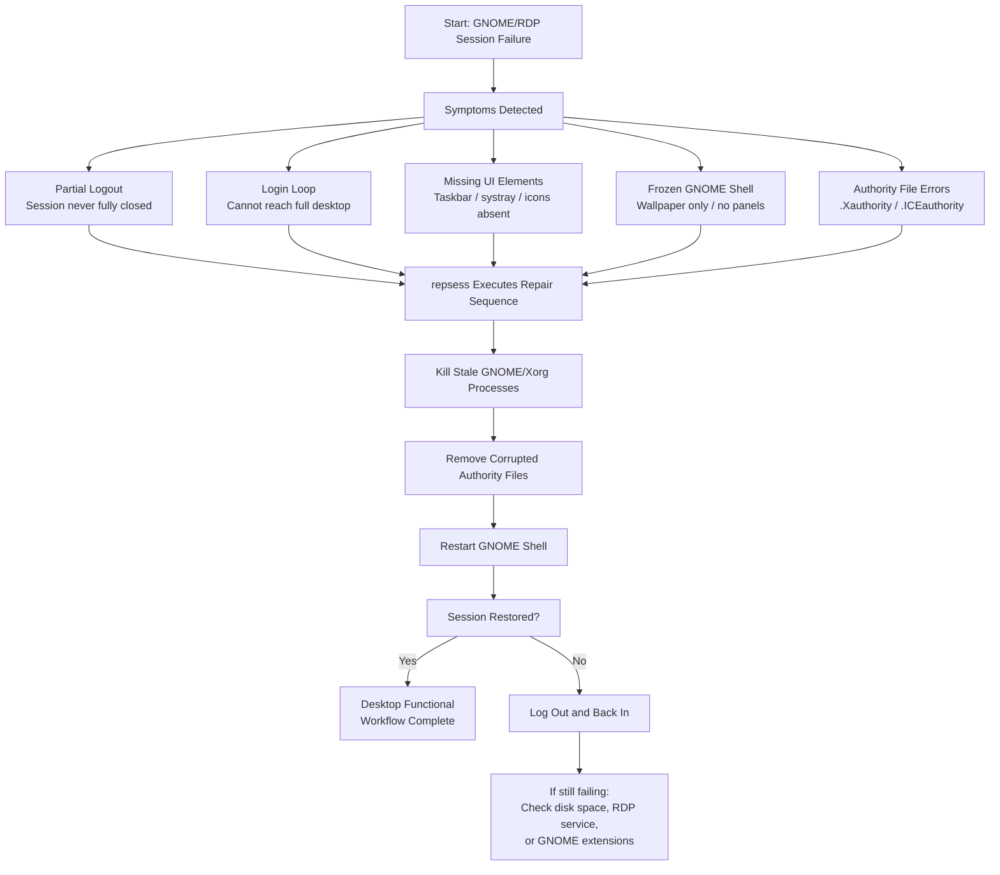

# 🖥️ repsess Workflow  
*A visual guide to repairing broken GNOME/RDP sessions*

`repsess` is designed to recover a GNOME or RDP session that has become unstable, partially loaded, or completely unusable.  
This asset provides a visual workflow showing when the tool is required, what it does, and how it restores a functional desktop environment.

---

## 📊 Workflow Diagram (Mermaid)

This diagram shows the full session‑repair lifecycle.

---

# 🧩 When repsess Is Required

This tool is used when GNOME or RDP fails in ways that prevent normal operation.  
Typical scenarios include:

### **1. Partial logout preventing full login**  
A logout was interrupted, leaving the session half‑open.  
Symptoms:

- login loop  
- desktop loads only partially  
- GNOME hangs before showing UI  

This is one of the most common triggers for `repsess`.

---

### **2. RDP reconnect causes missing UI elements**  
After reconnecting:

- taskbar missing  
- system tray not loading  
- desktop icons absent  
- GNOME shell frozen  

---

### **3. GNOME shell crashes or freezes**  
You may see:

- blank screen  
- wallpaper only  
- no panels or menus  

---

### **4. Corrupted authority files**  
If `.Xauthority` or `.ICEauthority` becomes invalid, GNOME cannot authenticate the session.

---

# 🛠️ What repsess Does Internally

`repsess` performs a controlled, safe repair sequence:

### **1. Terminates stale GNOME/Xorg processes**
These often remain after a broken logout or RDP disconnect.

### **2. Removes corrupted authority files**
GNOME regenerates them automatically.

### **3. Restarts GNOME shell**
Reloads the desktop environment without rebooting.

---

# 🧭 Expected Outcomes

### **Successful Repair**
- taskbar returns  
- systray loads  
- desktop icons appear  
- GNOME shell responds normally  

### **If the session is still broken**
Log out and back in — GNOME may need a fresh session.

---

# 🔗 Related Documentation

| Document | Purpose |
|---------|---------|
| `docs/repsess.md` | Full usage guide for repsess |
| `docs/cleanup.md` | System hygiene and cleanup |
| `docs/diag.md` | Diagnostics and environment checks |
| `README.md` | Toolbox overview & ethics |

---

## 🤖 AI & Ethics Disclosure

This asset was co‑authored with AI assistance.  
For details on responsible use, transparency, and authorship, see the **AI & Ethics** section in the Toolbox README.

🔙 Return to [Toolbox](https://github.com/Mark-a-Hamilton/Toolbox)
