# 🛰️ xfer Remote Operations Workflow  
*A visual DFIR‑aligned workflow for ethical remote transfer, execution, recovery, and cleanup*

`xfer` is designed for controlled, permission‑based remote operations.  
This workflow demonstrates a realistic DFIR scenario where a system owner has granted explicit access to an analyst for:

- remote connection  
- remote software upload (e.g., LinSuite)  
- remote execution  
- remote evidence recovery  
- remote cleanup  

This asset shows how `xfer` enables ethical, auditable remote work without ambiguity.

---

## 📊 Workflow Diagram (Mermaid)

This diagram shows the full DFIR‑style remote workflow using `xfer`.

```mermaid
flowchart TD

    A["Start: Permission Granted by System Owner"] --> B["Establish Remote Access"]
    B --> C["Upload DFIR Toolkit"]
    C --> D["Execute Remote Analysis"]
    D --> E["Collect Evidence\nxfer get REMOTE → LOCAL"]
    E --> F["Verify Completion via Trigger Files\nxfer test /path/to/triggers EXPECTED"]
    F --> G["Perform Remote Cleanup\nxfer run 'rm -r /tmp/LinSuite*'"]
    G --> H["Disconnect\nRemote workflow complete"]
```



---

## 🧭 Scenario Overview (DFIR Context)

A system owner has detected suspicious behaviour on a Linux host and has **granted explicit permission** for a DFIR analyst to:

- connect remotely  
- deploy a forensic triage tool  
- collect evidence  
- remove all tooling afterwards  

This is a common, legitimate workflow in:

- incident response  
- breach triage  
- malware analysis  
- internal investigations  
- SOC‑to‑endpoint workflows  

`xfer` provides a predictable, operator‑grade way to perform these tasks safely.

---

# 🧩 Step‑By‑Step Workflow

---

## **1. Permission Granted by System Owner**

Ethical remote access begins with:

- written permission  
- authorised credentials  
- a controlled communication channel  

This ensures compliance with DFIR best practices.

---

## **2. Establish Remote Access**

Verify connectivity and environment:

```
xfer run 192.168.1.50 analyst 'uname -a'
```

This confirms:

- SSH access works  
- credentials are valid  
- the remote system is responsive  

---

## **3. Upload DFIR Toolkit (e.g., LinSuite)**

Push the forensic triage tool to the remote host:

```
xfer put 192.168.1.50 analyst ./LinSuite.sh /tmp
```

Or upload a directory:

```
xfer put 192.168.1.50 analyst LinSuite/ /tmp '-r'
```

---

## **4. Execute Remote Analysis**

Run the toolkit remotely:

```
xfer run 192.168.1.50 analyst /tmp/LinSuite.sh
```

`xfer` ensures:

- script is made executable  
- stdout/stderr stream back to the operator  
- exit code is preserved  

---

## **5. Collect Evidence**

Pull results back to the analyst’s machine:

```
xfer get 192.168.1.50 analyst '/tmp/LinSuite/output/*' ~/DFIR/Evidence '-r'
```

This ensures:

- chain‑of‑custody  
- integrity  
- reproducibility  

---

## **6. Verify Completion via Trigger Files**

If the toolkit uses `.trg` files to signal completion:

```
xfer test 192.168.1.50 analyst /tmp/LinSuite/triggers 3
```

Exit codes:

| Code | Meaning |
|------|---------|
| 0 | All expected triggers found |
| 1 | Some triggers found |
| 2 | No triggers found |
| 3 | SSH failure |

This is ideal for automation or polling loops.

---

## **7. Perform Remote Cleanup**

Remove tools and temporary files:

```
xfer run 192.168.1.50 analyst 'rm -r /tmp/LinSuite*'
```

This ensures:

- no artefacts remain  
- no tools are left behind  
- the system is returned to its original state  

---

## **8. Disconnect**

The remote DFIR workflow is complete.

---

# 🎯 Why This Workflow Matters

This asset demonstrates:

- **ethical remote access**  
- **permission‑based DFIR operations**  
- **predictable, auditable tooling**  
- **clean lifecycle management**  
- **remote triage without persistent agents**  

It shows exactly how `xfer` fits into a real‑world, responsible operational context.

---

# 🔗 Related Documentation

| Document | Purpose |
|---------|---------|
| `docs/xfer.md` | Full usage guide for xfer |
| `docs/update.md` | System update workflow |
| `docs/cleanup.md` | System hygiene and cleanup |
| `docs/VirtualMachine.md` | Environment creation |
| `README.md` | Toolbox overview & ethics |

---

# 🤖 AI & Ethics Disclosure

This asset was co‑authored with AI assistance.  
For details on responsible use, transparency, and authorship, see the **AI & Ethics** section in the Toolbox README.

🔙 Return to [Toolbox](https://github.com/Mark-a-Hamilton/Toolbox)
