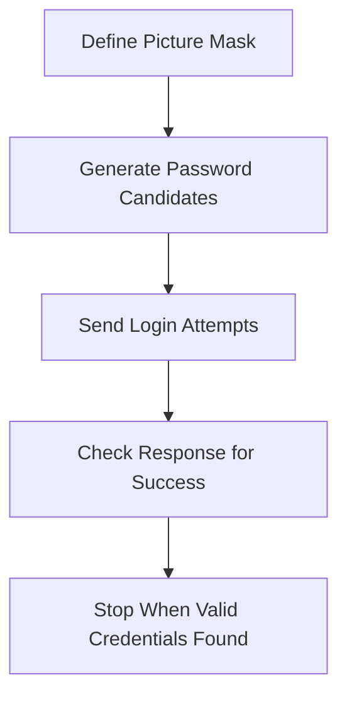

# 📘 **bf — Pattern‑Based Brute Force Demonstrator**

## 1. Introduction

`bf` is an educational tool designed to demonstrate how **predictable password patterns** can be rapidly brute‑forced when an attacker can infer the structure of the password.

Instead of using a traditional wordlist, `bf` generates passwords dynamically using **COBOL‑style picture masks**, such as:

- `9999` → four digits  
- `99A9` → two digits, one letter, one digit  
- `X9A9` → alphanumeric, digit, letter, digit  

This makes it ideal for:

- security awareness training  
- demonstrating weak password policies  
- THM rooms involving authentication bypass  
- teaching combinatorial password generation  
- illustrating why predictable patterns are dangerous  

This tool is **non‑malicious** and intended for **educational use only**.

---

## 2. How Picture Masks Work

A picture mask defines the **structure** of a password.  
Each character in the mask expands into a set of possible characters:

| Mask | Meaning | Character Set |
|------|---------|----------------|
| `9`  | Digit   | `0–9` |
| `A`  | Letter  | `a–zA–Z` |
| `X`  | Alphanumeric | `a–zA–Z0–9` |

### Example

Mask: `9A9`

Expands to:

- Digit  
- Letter  
- Digit  

So the password space is:

```
10 × 52 × 10 = 5200 combinations
```

This demonstrates how even “complex‑looking” passwords can collapse into a tiny keyspace when the pattern is known.

---

## 3. High‑Level Workflow

````markdown

````

---

## 4. Usage

### Basic usage

```
bf --url http://target/login --user admin --pic 9999
```

### Quiet mode (no per‑attempt output)

```
bf --url http://target/login --user admin --pic 99A9 --quiet
```

### Example: alphanumeric pattern

```
bf --url http://target/login --user bob --pic X9A9
```

---

## 5. Output Example

```
[INFO] Starting brute force using pattern: 99A9
[INFO] Username: admin

[-] Trying: 00a0
[-] Trying: 00a1
[-] Trying: 00a2
...
[+] Valid credentials discovered:
    Username: admin
    Password: 42Q7
```

---

## 6. When to Use This Tool

`bf` is ideal for:

- demonstrating why predictable password formats are insecure  
- showing how small keyspaces collapse under brute force  
- teaching password entropy  
- THM rooms involving login bypass  
- internal training on authentication weaknesses  

It is **not** intended for real‑world offensive use.

---

## 7. Limitations

- Assumes the target returns `"Invalid"` on failed login  
- Only supports POST requests with `username` and `password` fields  
- Does not handle CAPTCHAs, rate limiting, or lockouts  
- Intended for **educational** and **controlled** environments  

---

## 8. Example Picture Masks

| Mask | Description | Keyspace Size |
|------|-------------|----------------|
| `9999` | 4‑digit PIN | 10,000 |
| `99A9` | 2 digits, letter, digit | 5,200 |
| `A9A9` | letter, digit, letter, digit | 27,040 |
| `X9X9` | alphanumeric, digit, alphanumeric, digit | 37,440 |

These small keyspaces are trivial to brute force — which is the entire point of the tool.

---

## 9. Summary

`bf` is a compact, educational brute‑force demonstrator that:

- generates passwords from predictable patterns  
- shows how weak password structures collapse  
- helps users understand password entropy  
- supports THM‑style training and awareness exercises  
- reinforces secure password policy design  

It is intentionally minimal, safe, and easy to understand.

---

## 📢 Disclaimer

This tool performs **non‑destructive, educational brute‑force demonstrations only**.  
It does **not** bypass security controls, evade detection, or perform offensive actions.  
Use responsibly and only in environments where you have explicit permission.

---

## 🤖 AI & Ethics Disclosure

This tool and its documentation were co‑authored with AI assistance.  
For details on responsible use, transparency, and authorship, see the **AI & Ethics** section in the Toolbox README.

🔙 Return to [Toolbox](https://github.com/Mark-a-Hamilton/Toolbox)

