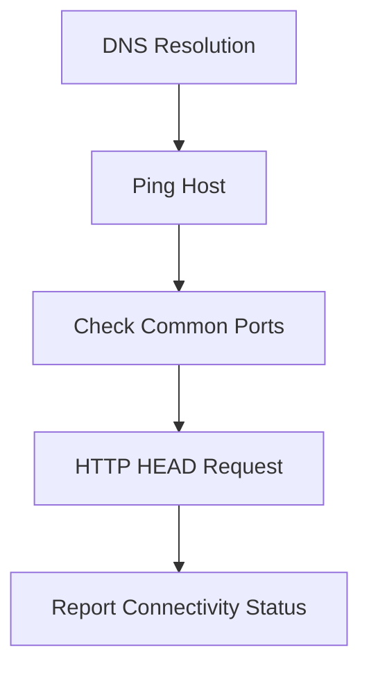

# 📘 **domcon — Domain Connectivity Preflight Checker**

## 1. Introduction

`domcon` is a lightweight, operator‑friendly tool that performs a **connectivity preflight check** against a target domain or hostname.

It answers a simple but critical question:

> **“Is this host actually reachable before I run anything more complex?”**

This is especially useful in:

- THM rooms  
- CTF environments  
- lab networks  
- remote workflows  
- troubleshooting sessions  
- before running scanners, brute‑force tools, or file‑transfer utilities  

Instead of relying on a single command like `ping`, `domcon` performs a **multi‑layer connectivity test**:

- DNS resolution  
- ICMP reachability  
- TCP port checks (80, 443, 8080)  
- HTTP HEAD request via curl  

This gives you a quick, reliable picture of whether the target is alive and responding.

---

## 2. Why domcon Exists

Tools like `ping` or `curl` only test one part of the connectivity chain.

`domcon` combines several checks into a single, consistent workflow:

| Check | Purpose |
|-------|---------|
| **DNS resolution** | “Does this domain exist?” |
| **Ping** | “Is the host reachable at all?” |
| **Port checks** | “Are common service ports open?” |
| **HTTP HEAD request** | “Does the web server respond?” |

This prevents wasted time debugging tools that “don’t work” when the real issue is simply:

- DNS failure  
- firewall blocking ICMP  
- closed ports  
- unreachable host  
- misconfigured domain  

It’s a small tool with big practical value.

---

## 3. High‑Level Workflow

````markdown

````

---

## 4. Usage

### Basic usage

```
domcon example.com
```

### Example output

```
[+] DNS OK: example.com → 93.184.216.34
[+] Pinging 93.184.216.34 ...
[+] Ping OK
[+] Port 80 open
[+] Port 443 open
[!] Port 8080 closed or unreachable
[+] HTTP HEAD request to example.com ...
HTTP/1.1 200 OK
...
```

---

## 5. When to Use domcon

`domcon` is ideal when you need to confirm:

- the target domain resolves  
- the host is reachable  
- expected ports are open  
- the web service is responding  

Typical scenarios:

- before running your **injection scanner (is)**  
- before using **xfer** to pull/push files  
- before running **bf**  
- before starting a THM room  
- when troubleshooting connectivity issues  
- when verifying lab infrastructure  

It’s a safe, non‑offensive diagnostic tool.

---

## 6. What domcon Checks

### ✔ DNS Resolution  
Confirms the domain maps to an IP address.

### ✔ ICMP Ping  
Checks basic host reachability.

### ✔ Port Checks  
Tests TCP connectivity to:

- 80 (HTTP)  
- 443 (HTTPS)  
- 8080 (common alt‑HTTP port)  

These can be expanded in future versions if needed.

### ✔ HTTP HEAD Request  
Uses `curl -I` to fetch only the headers — fast and non‑intrusive.

---

## 7. Limitations

- Requires ICMP to be allowed for ping results  
- Only checks three ports (by design — minimal noise)  
- Does not perform deep scanning or enumeration  
- Not a replacement for nmap or full diagnostics  

This tool is intentionally simple and predictable.

---

## 8. Summary

`domcon` is a compact, reliable connectivity preflight tool that:

- verifies DNS  
- checks reachability  
- tests common ports  
- confirms HTTP responsiveness  
- prevents wasted time on unreachable targets  
- fits perfectly into THM and lab workflows  

It’s a small but essential part of your operator‑grade toolbox.

---

## 📢 Disclaimer

This tool performs **non‑destructive connectivity checks only**.  
It does **not** perform scanning, enumeration, or offensive actions.  
Use responsibly and only in environments where you have explicit permission.

---

## 🤖 AI & Ethics Disclosure

This tool and its documentation were co‑authored with AI assistance.  
For details on responsible use, transparency, and authorship, see the **AI & Ethics** section in the Toolbox README.

🔙 Return to [Toolbox](https://github.com/Mark-a-Hamilton/Toolbox)
