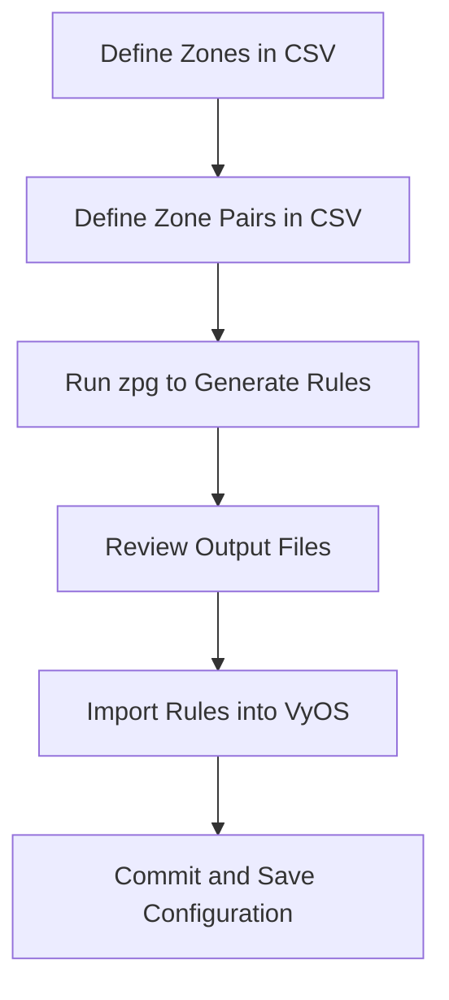

# 📘 **zpg — VyOS Zone Pair Generator**

## 1. Introduction

`zpg` is a lightweight Python tool that generates **VyOS zone‑policy and zone‑pair firewall rules** from a simple CSV definition file.

It is designed to:

- automate repetitive VyOS firewall configuration  
- reduce human error  
- speed up network segmentation tasks  
- support THM‑style network labs  
- help newcomers understand zone‑based firewalls  
- produce clean, import‑ready VyOS configuration snippets  

This tool is intentionally minimal and operator‑friendly:  
**no noise, no assumptions, no magic — just clean rule generation.**

---

## 2. What Are Zones?

A **zone** in VyOS is a logical grouping of interfaces.  
Instead of writing firewall rules per interface, you assign interfaces to zones and then define how zones interact.

Example zones:

- `LAN`  
- `DMZ`  
- `WAN`  
- `SERVERS`  
- `GUEST`  

Each zone has:

- one or more interfaces  
- a default action (e.g., `drop`, `reject`, `accept`)  

---

## 3. What Is a Zone Pair?

A **zone pair** defines how traffic is allowed or denied *between* two zones.

For example:

```
LAN → DMZ
DMZ → WAN
GUEST → LAN
```

Each zone pair has:

- a **source zone**  
- a **destination zone**  
- a **default action**  
- optional protocol‑specific rules  

VyOS implements this using:

```
set firewall name <zoneA-zoneB>
set zone-policy zone <zoneA> from <zoneB> firewall <name>
```

This is powerful but repetitive — which is exactly why **zpg** exists.

---

## 4. Why zpg Exists

Manually writing zone‑pair rules in VyOS is:

- repetitive  
- error‑prone  
- slow  
- difficult to maintain  
- hard for newcomers to understand  

`zpg` solves this by letting you define everything in a **simple CSV file**, then generating:

- zone definitions  
- zone‑pair firewall rules  
- protocol‑specific rules  
- logs for debugging  

This makes network segmentation:

- faster  
- cleaner  
- more consistent  
- easier to audit  

---

## 5. High‑Level Workflow

````markdown

````

---

## 6. CSV Format

Your CSV file contains two types of rows:

### **Zone definition (Z)**

```
Z,ZONE_NAME,INTERFACE,DEFAULT_ACTION
```

Example:

```
Z,LAN,eth1,drop
Z,DMZ,eth2,drop
Z,WAN,eth0,drop
```

### **Zone‑pair definition (ZP)**

```
ZP,SOURCE_ZONE,DEST_ZONE,PROTOCOL,ACTION,DEFAULT_ACTION
```

Example:

```
ZP,LAN,DMZ,HTTP,accept,drop
ZP,LAN,DMZ,SSH,accept,drop
ZP,DMZ,WAN,HTTPS,accept,drop
```

Protocols map to VyOS firewall syntax via:

- built‑in defaults  
- or a custom `protocols.json` file  

---

## 7. Usage

### Basic usage

```
zpg rules.csv
```

### Specify output directory

```
zpg rules.csv --out vyos-output
```

### Use a custom protocol map

```
zpg rules.csv --protocols my-protocols.json
```

### Dry‑run (print instead of writing files)

```
zpg rules.csv --dry-run
```

### Verbose logging

```
zpg rules.csv --verbose
```

### Preserve literal protocol names

```
zpg rules.csv --context-mode
```

---

## 8. Output Structure

After running:

```
zpg rules.csv
```

You get:

```
output/
├── rules/
│   ├── lan.zone
│   ├── dmz.zone
│   ├── lan-dmz.rules
│   └── dmz-wan.rules
└── logs/
    ├── lan-dmz.log
    └── dmz-wan.log
```

### **Zone files (`*.zone`)**
Contain:

- interface assignment  
- default action  

### **Rule files (`*.rules`)**
Contain:

- default action  
- established/related acceptance  
- invalid packet drop  
- protocol‑specific rules  

### **Log files (`*.log`)**
Contain:

- protocol mapping information  
- debugging output  

---

## 9. Importing into VyOS

Copy the generated files to your VyOS router, then load them:

```
load /config/zpg/lan.zone
load /config/zpg/lan-dmz.rules
```

Then commit:

```
commit
save
```

---

## 10. Example Scenario

### CSV:

```
Z,LAN,eth1,drop
Z,DMZ,eth2,drop
ZP,LAN,DMZ,HTTP,accept,drop
ZP,LAN,DMZ,SSH,accept,drop
```

### Generated rule snippet:

```
name lan-dmz {
  default-action drop
  enable-default-log
  rule 1 { action accept state { established enable related enable } }
  rule 2 { action drop log enable state { invalid enable } }
  rule 100 {
    action accept
    log enable
    protocol tcp
    destination port 80
  }
}
```

---

## 11. Summary

`zpg` transforms a simple CSV file into a complete, structured VyOS firewall configuration.

It is:

- fast  
- predictable  
- safe  
- easy to learn  
- ideal for THM labs  
- ideal for real network segmentation  
- ideal for teaching newcomers how zone‑based firewalls work  

This documentation ensures that even someone with **zero VyOS experience** can understand:

- what zones are  
- what zone pairs are  
- why they matter  
- how to define them  
- how to generate rules  
- how to import them  

---

