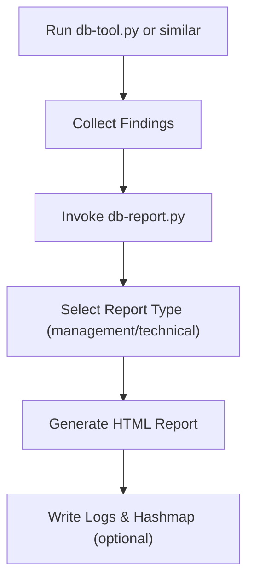

# 📘 **db-report.py — Database Vulnerability Report Generator**

## 1. Introduction

`db-report.py` is a Toolbox Python module that generates **HTML‑based security reports** summarising database vulnerabilities discovered by upstream analysis tools such as `db-tool.py`.

It produces two report types:

- **Management Report** — high‑level, executive‑friendly summary  
- **Technical Report** — detailed breakdown with severity ratings and remediation priorities  

The tool is designed for:

- Windows PrivEsc Arena workflows  
- THM‑style database security labs  
- internal training on database weaknesses  
- demonstrating attacker → defender reporting pipelines  
- teaching how findings are transformed into structured reports  

It is **non‑malicious**, **non‑destructive**, and intended for **educational use only**.

---

## 2. What This Tool Demonstrates

`db-report.py` models the *post‑analysis reporting phase* of an attacker workflow:

- enumeration →  
- vulnerability discovery →  
- credential extraction →  
- severity assessment →  
- remediation planning →  
- **report generation**

This helps learners understand:

- how raw findings become structured deliverables  
- how management vs technical audiences require different formats  
- how severity ratings influence remediation priority  
- how defenders interpret attacker‑style findings  

It reinforces both **attacker workflow literacy** and **defensive reporting skills**.

---

## 3. High‑Level Workflow

````markdown

````

---

## 4. Usage

### Basic usage

```
db-report.py --report management
```

### Technical report

```
db-report.py --report technical
```

### Dry‑run (simulate without writing files)

```
db-report.py --report management --dry-run
```

### Verbose mode

```
db-report.py --report technical --verbose
```

### Logging + Hashmap traceability

```
db-report.py --report management --log --hashmap
```

---

## 5. Output Files

When optional flags are used:

| File | Purpose |
|------|---------|
| `/var/log/db-report.py.log` | Execution log (when `--log` is used) |
| `.hashmap/db-report.py.hash` | SHA‑256 hash of the script (when `--hashmap` is used) |
| `.hashmap/db-report.py.timestamp` | Timestamp of execution (when `--hashmap` is used) |

These reinforce **traceability**, **repeatability**, and **forensic reasoning** — consistent with all Toolbox Python tools.

---

## 6. Report Types

### **Management Report**

A high‑level summary suitable for:

- executives  
- management  
- non‑technical stakeholders  

Includes:

- detected vulnerabilities  
- extracted credentials  
- general recommendations  

### **Technical Report**

A detailed breakdown suitable for:

- security engineers  
- analysts  
- defenders  
- THM learners  

Includes:

- vulnerabilities  
- severity ratings  
- extracted credentials  
- remediation priorities  
- mitigation strategies  

---

## 7. Example Output (Management)

```
[+] Management report saved as: db_tool_management_20260724_153022.html
```

Inside the HTML:

- Summary  
- Vulnerability list  
- Extracted credentials  
- Recommendations  

---

## 8. Example Output (Technical)

```
[+] Technical report saved as: db_tool_technical_20260724_153045.html
```

Inside the HTML:

- Summary  
- Vulnerabilities + severity  
- Credentials  
- Remediation priority  
- Mitigation strategies  

---

## 9. Educational Value

`db-report.py` is ideal for:

- demonstrating attacker → defender reporting pipelines  
- teaching how findings are structured into deliverables  
- showing the difference between management vs technical reporting  
- reinforcing severity‑based remediation planning  
- THM rooms involving database security  
- internal awareness training  

It is **not** intended for real‑world offensive use.

---

## 10. Limitations

- Uses placeholder findings unless integrated with `db-tool.py`  
- Does not perform database scanning itself  
- Assumes HTML output is acceptable  
- No PDF/CSV export  
- Intended for **controlled environments** only  

These limitations are intentional — the tool focuses on **reporting**, not exploitation.

---

## 11. Summary

`db-report.py` is a structured, educational reporting tool that:

- transforms database findings into HTML reports  
- supports both management and technical audiences  
- reinforces attacker workflow literacy  
- teaches defensive reporting and remediation planning  
- integrates cleanly with the Toolbox architecture  

It is transparent, predictable, and ideal for PrivEsc Arena and THM‑style learning.

---

## 📢 Disclaimer

This tool performs **non‑destructive, educational reporting only**.  
It does **not** scan databases, exploit vulnerabilities, or perform offensive actions.  
Use responsibly and only in environments where you have explicit permission.

---

## 🤖 AI & Ethics Disclosure

This documentation was co‑authored with AI assistance.  
For details on responsible use, transparency, and authorship, see the **AI & Ethics** section in the Toolbox README.

🔙 Return to Toolbox

---

