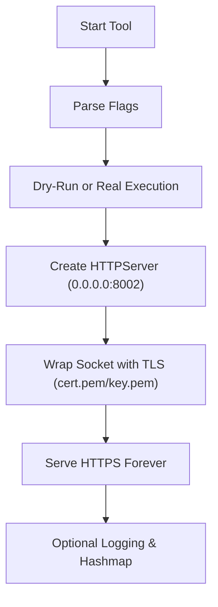

# 📘 **https.py — Minimal TLS‑Enabled HTTPS Listener**

## 1. Introduction

`https.py` is a lightweight Toolbox module that launches a **minimal HTTPS server** using Python’s built‑in `http.server` framework. It is designed for:

- local testing  
- controlled lab environments  
- exposing simple HTTPS endpoints  
- demonstrating TLS wrapping behaviour  
- teaching how certificates enable encrypted transport  

The tool binds to:

```
0.0.0.0:8002
```

and wraps the socket using:

- `cert.pem` — certificate  
- `key.pem` — private key  

It is intentionally minimal, safe, and ideal for PrivEsc Arena, THM labs, and internal training.

---

## 2. What This Tool Demonstrates

`https.py` models the **transport‑layer security setup** phase of an attacker or defender workflow:

- how a raw HTTP server becomes HTTPS  
- how certificates and private keys wrap sockets  
- how encrypted endpoints behave  
- how tooling interacts with TLS‑enabled services  

It reinforces:

- attacker literacy (understanding encrypted endpoints)  
- defender literacy (understanding TLS wrapping and service exposure)  
- systems‑thinking around secure communication  

---

## 3. High‑Level Workflow



---

## 4. Usage

### Start HTTPS listener

```
https.py
```

### Dry‑run (simulate startup)

```
https.py --dry-run
```

### Verbose mode

```
https.py --verbose
```

### Logging + Hashmap traceability

```
https.py --log --hashmap
```

---

## 5. Output Files

When optional flags are used:

| File | Purpose |
|------|---------|
| `/var/log/https.py.log` | Execution log (when `--log` is used) |
| `.hashmap/https.py.hash` | SHA‑256 hash of the script (when `--hashmap` is used) |
| `.hashmap/https.py.timestamp` | Timestamp of execution (when `--hashmap` is used) |

These reinforce **traceability**, **repeatability**, and **forensic reasoning** — consistent across all Toolbox Python tools.

---

## 6. Behaviour Overview

### Server Binding

The tool creates a basic HTTP server:

```
HTTPServer(('0.0.0.0', 8002), BaseHTTPRequestHandler)
```

### TLS Wrapping

The socket is wrapped using:

```
ssl.wrap_socket(
    httpd.socket,
    keyfile="key.pem",
    certfile="cert.pem",
    server_side=True
)
```

This transforms the listener into a **TLS‑enabled HTTPS endpoint**.

### Output Example

```
[+] HTTPS server running on https://0.0.0.0:8002
```

---

## 7. Educational Value

`https.py` is ideal for:

- demonstrating how TLS wrapping works  
- teaching certificate + key pairing  
- showing how encrypted endpoints behave  
- modelling secure service exposure  
- THM rooms involving HTTPS or TLS concepts  
- internal awareness training  

It is **not** intended for production use.

---

## 8. Limitations

- Uses Python’s minimal `BaseHTTPRequestHandler`  
- No routing, no content serving  
- Requires `cert.pem` and `key.pem` in working directory  
- No error handling for missing certificates  
- Intended for **controlled environments** only  

These limitations are intentional — the tool focuses on **education**, not deployment.

---

## 9. Summary

`https.py` is a compact, educational HTTPS listener that:

- wraps a socket with TLS  
- demonstrates certificate‑based encryption  
- exposes a simple HTTPS endpoint  
- reinforces secure communication concepts  
- integrates cleanly with the Toolbox architecture  

It is transparent, predictable, and ideal for PrivEsc Arena and THM‑style learning.

---

## 📢 Disclaimer

This tool performs **non‑destructive, educational demonstrations only**.  
It does **not** provide production‑grade HTTPS hosting or advanced TLS features.  
Use responsibly and only in environments where you have explicit permission.

---

## 🤖 AI & Ethics Disclosure

This documentation was co‑authored with AI assistance.  
For details on responsible use, transparency, and authorship, see the **AI & Ethics** section in the Toolbox README.

🔙 Return to [Toolbox](https://github.com/Mark-a-Hamilton/Toolbox)

---

