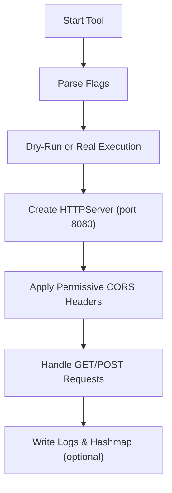

# 📘 **server.py — Lightweight CORS‑Enabled HTTP Listener**

## 1. Introduction

`server.py` is a lightweight Toolbox module that launches a **simple HTTP server** on port **8080** with fully permissive **CORS headers**. It is designed for:

- webhook testing  
- client‑side request debugging  
- cross‑origin behaviour demonstrations  
- THM labs involving HTTP request handling  
- modelling attacker/defender interactions with simple endpoints  

The server responds to:

- **GET** → static greeting  
- **POST** → logs request body to `data.html` and returns confirmation  

It is intentionally minimal, safe, and ideal for PrivEsc Arena, THM labs, and internal training.

---

## 2. What This Tool Demonstrates

`server.py` models the **HTTP request/response workflow**, showing:

- how CORS headers enable cross‑origin requests  
- how GET and POST handlers behave  
- how servers log incoming data  
- how simple endpoints are used in testing and demonstrations  

It reinforces:

- attacker literacy (understanding how endpoints behave)  
- defender literacy (understanding CORS exposure and logging)  
- systems‑thinking around HTTP communication  

---

## 3. High‑Level Workflow



---

## 4. Usage

### Start HTTP listener

```
server.py
```

### Dry‑run (simulate startup)

```
server.py --dry-run
```

### Verbose mode

```
server.py --verbose
```

### Logging + Hashmap traceability

```
server.py --log --hashmap
```

---

## 5. Output Files

When optional flags are used:

| File | Purpose |
|------|---------|
| `/var/log/server.py.log` | Execution log (when `--log` is used) |
| `.hashmap/server.py.hash` | SHA‑256 hash of the script (when `--hashmap` is used) |
| `.hashmap/server.py.timestamp` | Timestamp of execution (when `--hashmap` is used) |

These reinforce **traceability**, **repeatability**, and **forensic reasoning** — consistent across all Toolbox Python tools.

---

## 6. CORS Behaviour

The server applies permissive CORS headers to **every** response:

```
Access-Control-Allow-Origin: *
Access-Control-Allow-Methods: GET, POST, OPTIONS
Access-Control-Allow-Headers: Content-Type
```

This makes the endpoint ideal for:

- cross‑origin testing  
- browser‑based client experiments  
- webhook debugging  
- demonstrating insecure CORS configurations  

---

## 7. Request Handling

### GET Requests

```
Hello, GET request!
```

Useful for:

- connectivity checks  
- basic endpoint testing  
- verifying CORS behaviour  

### POST Requests

The server:

1. reads the request body  
2. appends it to `data.html`  
3. returns a confirmation message  

Example:

```
THM, POST request! Received data: <payload>
```

This models how servers log incoming data and respond to client submissions.

---

## 8. Example Output

### Startup

```
[+] Server running on http://localhost:8080/
```

### POST Logging

```
[+] Received POST data: username=admin&password=1234
```

And `data.html` is updated accordingly.

---

## 9. Educational Value

`server.py` is ideal for:

- demonstrating CORS behaviour  
- teaching GET/POST handling  
- modelling simple HTTP endpoints  
- showing how servers log incoming data  
- THM rooms involving web exploitation  
- internal awareness training  

It is **not** intended for production use.

---

## 10. Limitations

- No routing or advanced request handling  
- No HTTPS support  
- No authentication or access control  
- Logs POST bodies directly to `data.html`  
- Intended for **controlled environments** only  

These limitations are intentional — the tool focuses on **education**, not deployment.

---

## 11. Summary

`server.py` is a compact, educational HTTP listener that:

- applies permissive CORS headers  
- handles GET and POST requests  
- logs POST bodies to `data.html`  
- reinforces HTTP communication concepts  
- integrates cleanly with the Toolbox architecture  

It is transparent, predictable, and ideal for PrivEsc Arena and THM‑style learning.

---

## 📢 Disclaimer

This tool performs **non‑destructive, educational demonstrations only**.  
It does **not** provide production‑grade HTTP hosting or advanced web features.  
Use responsibly and only in environments where you have explicit permission.

---

## 🤖 AI & Ethics Disclosure

This documentation was co‑authored with AI assistance.  
For details on responsible use, transparency, and authorship, see the **AI & Ethics** section in the Toolbox README.

🔙 Return to [Toolbox](https://github.com/Mark-a-Hamilton/Toolbox)

---
