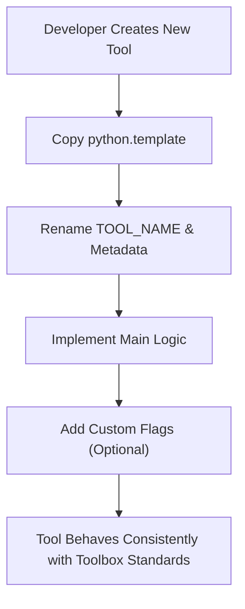

# 📘 **template — Standardised Toolbox Script Framework**

## 1. Introduction

`python.template` is the **canonical base template** used to create all Python tools inside the Toolbox. It provides a fully‑structured, production‑ready skeleton that ensures every tool behaves consistently, including:

- unified metadata  
- unified CLI flags  
- unified logging  
- unified hashmap traceability  
- unified dry‑run behaviour  
- unified helper functions  
- unified main‑logic structure  

This template is the foundation for tools such as:

- `sql-creds.py`  
- `nosql-creds.py`  
- `db-tools`  
- `db-report.py`  
- `rev-shell.py`  
- `server.py`  
- `https.py`  

It ensures the Toolbox remains **predictable**, **maintainable**, and **professionally structured**.

---

## 2. What This Template Provides

The template gives developers a complete, ready‑to‑extend framework:

### **Metadata Block**
Defines:

- tool name  
- version  
- log file path  
- hashmap file paths  

### **Helper Functions**
Includes:

- `log()` — verbose logging  
- `run_step()` — dry‑run aware command execution  
- `write_log()` — structured log output  
- `write_hashmap()` — SHA‑256 traceability  

### **Main Logic Stub**
A placeholder block where developers insert the tool’s core functionality.

### **Unified CLI Flags**
Every tool supports:

- `--dry-run`  
- `--verbose`  
- `--log`  
- `--hashmap`  

This ensures consistent behaviour across the entire Toolbox.

---

## 3. High‑Level Workflow



---

## 4. Usage

### Creating a new tool

1. Copy the template file  
2. Rename the script (e.g., `mytool.py`)  
3. Update:

```
TOOL_NAME = "mytool.py"
VERSION = "2026.07.24-00"
```

4. Replace:

```
<REPLACE WITH PURPOSE>
<REPLACE WITH A CLEAR DESCRIPTION OF THE TOOL>
```

5. Implement your logic inside:

```
def main_logic(args):
```

6. Add any custom flags if needed  
7. Save and run your new tool

---

## 5. Template Features

### **Dry‑Run Mode**
Simulates actions without executing them:

```
mytool.py --dry-run
```

### **Verbose Logging**
Shows internal steps:

```
mytool.py --verbose
```

### **Execution Logging**
Writes structured logs to `/var/log/<toolname>.log`:

```
mytool.py --log
```

### **Hashmap Traceability**
Creates:

- `<toolname>.hash`  
- `<toolname>.timestamp`  

Useful for:

- auditing  
- reproducibility  
- forensic reasoning  

---

## 6. Example Output

```
[LOG] Starting mytool.py version 2026.07.24-00
Hello from mytool.py!
Replace this block with your tool's logic.
```

Dry‑run example:

```
[DRY-RUN] Would execute: echo Doing something important...
```

---

## 7. When to Use This Template

Use `python.template` whenever you create:

- a new enumeration tool  
- a new reporting tool  
- a new server or listener  
- a new payload generator  
- a new PrivEsc helper  
- any new Python module inside the Toolbox  

It ensures:

- consistency  
- readability  
- maintainability  
- professional structure  

---

## 8. Limitations

- Template does not include tool‑specific logic  
- Developers must implement their own payloads, enumeration, or server behaviour  
- No built‑in error handling beyond basic logging  
- Intended for **controlled environments** only  

These limitations are intentional — the template is a **framework**, not a full tool.

---

## 9. Summary

`python.template` is the backbone of the Toolbox Python ecosystem. It:

- enforces consistent structure  
- provides unified logging and traceability  
- simplifies development  
- ensures every tool behaves predictably  
- supports attacker‑workflow modelling and defender reasoning  
- keeps the Toolbox clean, professional, and scalable  

It is the starting point for every new Python tool you create.

---

## 📢 Disclaimer

This template is for **educational and development use only**.  
It does **not** perform any offensive actions by itself.  
Use responsibly and only in environments where you have explicit permission.

---

## 🤖 AI & Ethics Disclosure

This documentation was co‑authored with AI assistance.  
For details on responsible use, transparency, and authorship, see the **AI & Ethics** section in the Toolbox README.

🔙 Return to [Toolbox](https://github.com/Mark-a-Hamilton/Toolbox)

---
